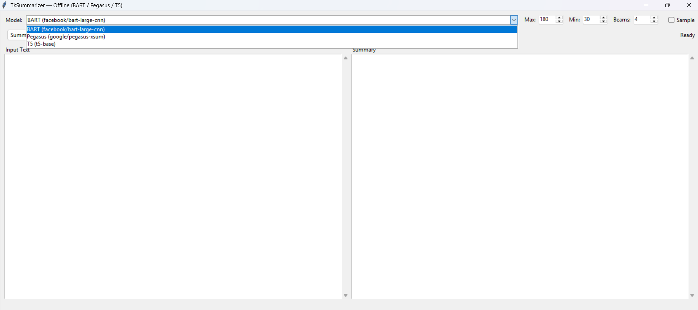
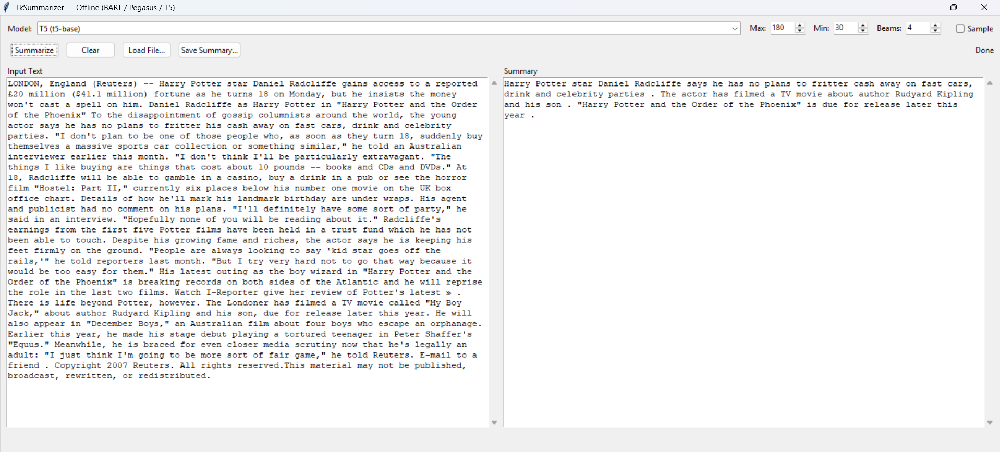

📝 Text Summarization App
A simple offline desktop application for text summarization built with Python (Tkinter) and Hugging Face Transformers.

This app allows you to summarize long pieces of text into concise, meaningful summaries using state-of-the-art fine tuned NLP models like BART, Pegasus, and T5.

🚀 Features
Multiple Models Support
Choose from BART, Pegasus, and T5 for summarization.

Offline Functionality
After the first model download, the app works completely offline.

Customizable Parameters

max_length → maximum length of the generated summary

min_length → minimum length of the summary

num_beams → beam search size for better results

🛠️ Technologies Used

Python 3.9+

Tkinter (GUI framework)

Transformers (Hugging Face)

Torch (PyTorch backend)

#Fine Tuning Sctips are also added for all the models. 

APPLICATION SCREENSHOT

